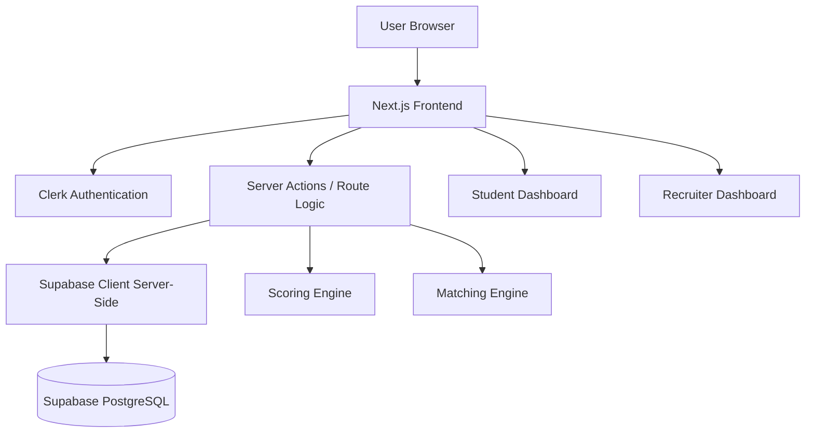

# StuScout — Project Report

**Table of Contents**

1. [Introduction](#1-introduction)  
2. [Existing System vs Proposed](#2-existing-system-vs-proposed)  
3. [Research Gaps](#3-research-gaps)  
4. [Problem Statement](#4-problem-statement)  
5. [Proposed Project Objectives](#5-proposed-project-objectives)  
6. [Proposed Project Outcomes](#6-proposed-project-outcomes)  
7. [Software and Hardware Requirements](#7-software-and-hardware-requirements)  
8. [Architectural Diagram](#8-architectural-diagram)  
9. [Proposed Methods and Algorithms](#9-proposed-methods-and-algorithms)  
10. [Results](#10-results)  
11. [Research Paper (Acceptance Proofs)](#11-research-paper-acceptance-proofs)  
12. [Conclusion](#12-conclusion)  

**Appendix:** Extended system design, data-flow diagrams, UML (Mermaid), and database summary — see `SYSTEM_DESIGN.md` in this repository.

---

## 1. Introduction

**StuScout** is a web application for skill-first campus hiring aimed at B.Tech students and recruiters. It provides separate experiences for **students** (profile building, readiness signals, dashboard insights) and **recruiters** (company-linked accounts, job roles, candidate matching, shortlists, and pipeline updates). The product emphasizes verified, structured signals (projects, skills, questionnaire, certifications, achievements, challenge attempts) over raw résumé-only screening.

The implementation uses **Next.js** (App Router), **Clerk** for authentication, **Supabase (PostgreSQL)** for persistence, and **TypeScript** throughout. The landing page presents the product; authenticated users complete **onboarding** to bind their Clerk identity to an application **profile** and either a **student profile** or **company** record, after which they use role-specific dashboards.

---

## 2. Existing System vs Proposed

| Aspect | Typical existing systems | **Proposed (StuScout)** |
|--------|-------------------------|-------------------------|
| Screening basis | CGPA, college tier, unstructured CVs | Skill tags, project evidence, questionnaire, composite **readiness score** |
| Auth & identity | Ad-hoc credentials or single generic login | **Clerk**-managed sign-in; explicit **student vs recruiter** role in app data |
| Data store | Spreadsheets, email, or generic job portals | **Relational model** in Supabase: profiles, companies, student_profiles, job_roles, shortlists |
| Student experience | Static profile or portal upload only | **Dashboard** with completion metrics, recommendations, and profile studio |
| Recruiter experience | Manual shortlisting | **Role posting**, **tag-based matching**, **shortlist** with pipeline states (shortlisted / scheduled / offered) |
| Matching | Manual search or keyword only | **Jaccard-style tag overlap** blended with **composite score** (`src/lib/matching/v1.ts`) |
| Deployment shape | Monolithic or unclear separation | Clear layers: browser → Next.js → Clerk + server logic → Supabase |

---

## 3. Research Gaps

- **Gap — Explainable skill fit:** Many portals rank candidates opaquely. StuScout exposes **match explanations** (e.g., tag match counts vs role tags) alongside a transparent **scoring breakdown** (projects, questionnaire, skills, assessment stub, endorsements).
- **Gap — Dual-role clarity:** Single sign-up flows often blur hiring vs job-seeking. StuScout uses **onboarding role selection**, **post-login role alignment**, and **layout guards** so students and recruiters land in the correct area.
- **Gap — Structured campus signals:** Certifications, achievements, and challenge attempts are often free text only. The system stores them as **structured JSONB** fields with validated forms.
- **Gap — Integrated pipeline:** Shortlisting is often disconnected from interview scheduling state. StuScout stores **per-role shortlist entries** with status and optional scheduling metadata in JSONB.

*(Adjust wording if your institution requires citations to published literature; the above maps product choices to common industry gaps.)*

---

## 4. Problem Statement

Campus hiring often relies on **coarse filters** (CGPA, institution) and **unstructured documents**, which under-represent practical skills and project work. Recruiters lack a **single place** to define role skill expectations, **rank students** by fit, and **track pipeline** states. Students lack guidance to **present evidence** (projects, skills, behavioral signals) in a way that maps to recruiter needs.

**StuScout** addresses this by: (1) binding each user to a clear **student or recruiter** profile in the database; (2) computing a **composite readiness score** from multiple signals; (3) **matching** students to roles using role skill tags and the score; and (4) supporting **shortlist and pipeline** updates per role.

---

## 5. Proposed Project Objectives

1. Deliver a **modern web UI** (landing + student dashboard + recruiter dashboard) with responsive layouts and consistent branding.  
2. Integrate **Clerk** for secure authentication and session handling.  
3. Persist all core entities in **Supabase PostgreSQL** with migrations for schema evolution.  
4. Implement **onboarding** that creates the correct rows (`profiles`, `student_profiles` or `companies` + `company_id` link).  
5. Implement **student profile editing** with validation (Zod), URL sanitization, and **score recomputation** on save.  
6. Enable recruiters to **create job roles**, **view ranked matches**, **shortlist** students, and **update pipeline** entries.  
7. Provide **role-mismatch** handling when login intent (student vs recruiter) does not match the stored profile.  
8. Document **architecture**, **data flow**, and **UML-style** views for academic reporting (`SYSTEM_DESIGN.md`).

---

## 6. Proposed Project Outcomes

- A **deployable** Next.js application with documented environment variables (Clerk keys, Supabase URL, service role key on server only).  
- **Two functional dashboards** with navigation shells, theme options where implemented, and core actions wired to server actions and data loaders.  
- A **maintainable schema** (`supabase/migrations/`) including extended student fields (certifications, achievements, challenge_attempts).  
- **Measurable student signals**: composite score and breakdown stored and reflected in the UI.  
- **Recruiter workflow**: at least one complete path from role creation → match view → shortlist → pipeline update.  
- **Technical report artifacts**: this report plus `SYSTEM_DESIGN.md` for diagrams and database summary.

---

## 7. Software and Hardware Requirements

### 7.1 Software (development & runtime)

| Category | Requirement |
|----------|-------------|
| Operating system | Windows 10/11, macOS, or Linux (development); hosting OS per deployment target |
| Node.js | Compatible with Next.js 16 (e.g. Node 20 LTS recommended) |
| Package manager | npm (project uses `package.json` / `package-lock.json`) |
| Browser | Modern Chromium, Firefox, or Safari (ES modules, Clerk session) |
| Editor / IDE | VS Code or Cursor (optional) |
| Accounts | Clerk application; Supabase project |
| Version control | Git |

**Key dependencies** (from `package.json`): Next.js, React, `@clerk/nextjs`, `@supabase/supabase-js`, Zod, Tailwind CSS, Framer Motion, Lucide React, Sonner, Radix UI primitives.

### 7.2 Hardware

| Resource | Minimum (typical dev) | Recommended |
|----------|----------------------|-------------|
| Processor | Multi-core x64/ARM64 | Recent quad-core or better |
| RAM | 8 GB | 16 GB or more |
| Storage | ~2 GB free for repo + `node_modules` + build | SSD |
| Network | Internet for Clerk, Supabase, and package installs | Stable broadband |

**Production hosting** (if deployed): Vercel or similar for Next.js; Supabase managed PostgreSQL; Clerk cloud — scale per traffic (not fixed in repo).

---

## 8. Architectural Diagram

High-level view of StuScout (browser, app server, auth, database, and main subsystems):

**Further diagrams** (Level 0/1 DFD, class/object/use case/sequence/activity/component/deployment, database tables): see **`SYSTEM_DESIGN.md`**.

---

## 9. Proposed Methods and Algorithms

### 9.1 Development method

- **Iterative development** on Next.js App Router: pages and layouts for public, onboarding, student, and recruiter areas.  
- **Server-first data access**: `getAuthSession()`, `getProfileByClerkUserId()`, and Supabase queries in `src/lib/data/*` and server actions in `src/actions/*`.  
- **Input validation** with **Zod** before database writes.  
- **Schema migrations** in SQL under `supabase/migrations/` for reproducible database state.

### 9.2 Composite score (student readiness)

Implemented in `src/lib/scoring/v1.ts` as **`computeCompositeScoreV1`**. It aggregates capped contributions from:

- **Projects** (with optional GitHub URL bonus),  
- **Questionnaire** (keys `q1`–`q5`, values 1–5),  
- **Skills** (normalized tags, points per skill up to a cap),  
- **Assessment** (stub 0–100 or neutral default),  
- **Endorsements** (count-based cap).

Output: **composite** (0–100) and **breakdown** object persisted in `student_profiles`.

### 9.3 Role–student matching

Implemented in `src/lib/matching/v1.ts`:

- **Tag normalization** for role `skill_tags` and student `skills`.  
- **Jaccard similarity** between tag sets.  
- **Weighted score**: `MATCH_V1.tagWeight * jaccard + MATCH_V1.compositeWeight * (compositeScore / 100)` (with fallback when role has no tags).  
- Top matches returned for recruiter UI (`src/lib/data/matches.ts`).

### 9.4 Shortlist and pipeline

- Shortlists stored **per job role** with **JSONB `entries`** (`ShortlistEntryJson`: id, student_id, status, scheduled_at, notes).  
- Server actions **`addStudentToShortlist`**, **`updatePipelineEntry`** in `src/actions/recruiter.ts` enforce recruiter authorization and company–role ownership.

---

## 10. Results

Document **your** measured outcomes here; below is a template aligned with what the system actually delivers.

| Result area | Expected observation |
|-------------|----------------------|
| Authentication | Users can sign in via Clerk; unauthenticated access to `/student` and `/recruiter` redirects to login. |
| Onboarding | New users without a `profiles` row are sent to `/onboarding`; student path creates `student_profiles`; recruiter path creates `companies` and links `company_id`. |
| Student dashboard | Loads aggregated data from `getStudentDashboardData`; profile edits update Supabase and refresh score. |
| Recruiter dashboard | Home loads company roles; role pages show matches and shortlist actions where implemented. |
| API health | `GET /api/health/db` returns database connectivity when env vars are set. |
| Build | `npm run build` succeeds when types and env are correct. |

**Screenshots / metrics:** Add figures (e.g., landing page, student dashboard, recruiter matches, Supabase table row counts) as your submission requires.

---

## 11. Research Paper (Acceptance Proofs)

This section is for **your** academic or publication record.

- If you have submitted or published a paper related to StuScout (skill-first hiring, matching, campus tech, etc.), attach:  
  - acceptance email or letter,  
  - conference proceedings page,  
  - DOI link, or  
  - camera-ready PDF.  

- If **no paper** has been accepted yet, state: *“No research paper acceptance at the time of this report. This subsection will be updated with camera-ready copy and acceptance proof upon publication.”*

*(Do not fabricate acceptance documents; examiners expect honest placeholders or real attachments.)*

---

## 12. Conclusion

StuScout implements a **skill-first, role-separated** hiring platform for students and recruiters using **Next.js**, **Clerk**, and **Supabase**. The design separates concerns into presentation, authentication, business logic (scoring, matching, shortlists), and relational storage. Students benefit from structured profiles and a data-driven readiness score; recruiters benefit from tag-based matching and pipeline-aware shortlists. The project is documented for coursework and further work via this report and **`SYSTEM_DESIGN.md`** (architecture, DFDs, UML-style diagrams, and database summary).

---

*End of report. For extended diagrams and Chapter 4–style system design detail, open `SYSTEM_DESIGN.md` in the project root.*
