# CHAPTER 4. SYSTEM DESIGN

## 4.1 System Architecture

StuScout is a role-based skill-first hiring platform built with **Next.js**, **Clerk Authentication**, and **Supabase PostgreSQL**. The system supports two primary user roles: **Student** and **Recruiter**. Students create rich technical profiles, while recruiters post job roles, discover matched students, and manage shortlist pipelines.

The application follows a modern web architecture with:
- **Presentation Layer**: Next.js App Router pages, layouts, and reusable React components.
- **Application Layer**: Server actions, routing logic, dashboard data mappers, scoring engine, and matching engine.
- **Authentication Layer**: Clerk handles sign-up, sign-in, session management, and user identity.
- **Data Layer**: Supabase PostgreSQL stores profiles, companies, student profiles, job roles, and shortlists.

### Architectural Style
The project mainly follows a **layered architecture**:
- UI Layer
- Business Logic Layer
- Data Access Layer
- Persistence Layer

### Core Modules
- Landing and public authentication flow
- Onboarding flow
- Student dashboard and profile management
- Recruiter dashboard and role management
- Matching and ranking module
- Shortlist and pipeline management
- Theme management and shared UI components

### High-Level Architecture Diagram

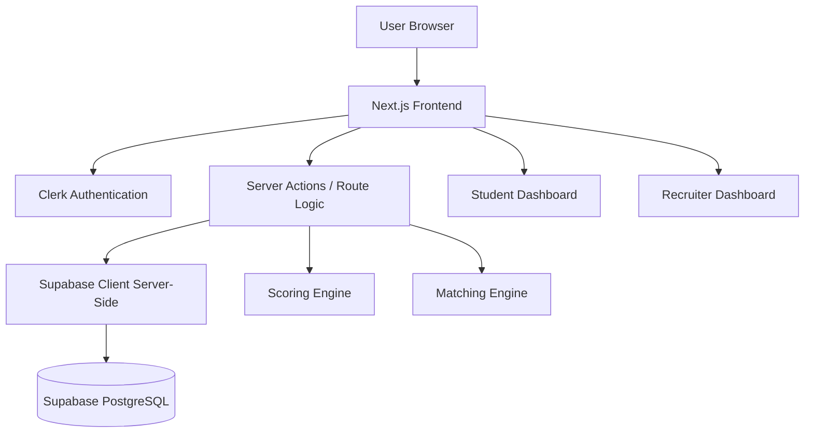

### Codebase Evidence
- Root app shell: `src/app/layout.tsx`
- Global providers: `src/components/Providers.tsx`
- Auth/session bridge: `src/lib/session.ts`
- Server-side Supabase client: `src/lib/supabase/server.ts`
- Student data aggregation: `src/lib/data/student.ts`
- Recruiter data aggregation: `src/lib/data/recruiter.ts`
- Matching logic: `src/lib/matching/v1.ts`
- Scoring logic: `src/lib/scoring/v1.ts`

---

## 4.2 Data Flow Diagram

### 4.2.1 Level 0 Data Flow Diagram

The system receives input from users, validates identity through Clerk, processes role-based logic, and persists/retrieves records from Supabase.

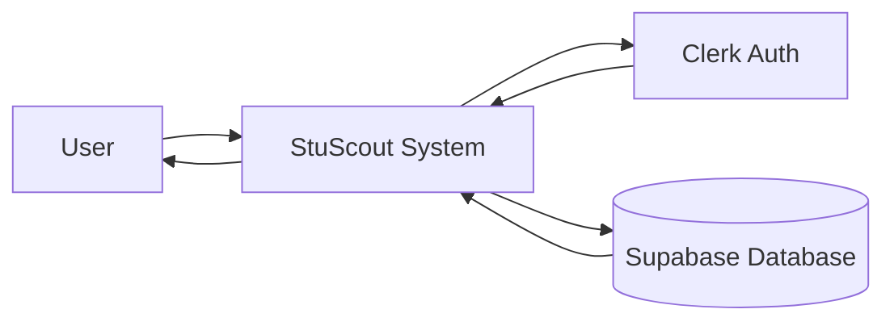

### 4.2.2 Level 1 Data Flow Diagram

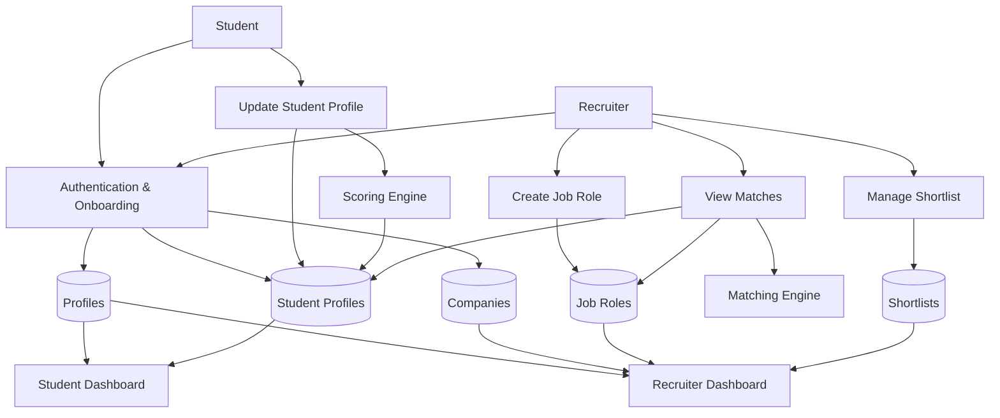

### Main Data Flows
1. User signs in with Clerk.
2. System checks whether a matching profile exists in Supabase.
3. If absent, user is redirected to onboarding.
4. Student onboarding creates `profiles` and `student_profiles`.
5. Recruiter onboarding creates `profiles`, `companies`, and links `company_id`.
6. Student profile updates recompute composite score.
7. Recruiter job roles are matched against student profiles.
8. Recruiter can shortlist and update candidate pipeline status.

---

## 4.3 UML Diagrams

## 4.3.1 Class Diagram
`images/class-diagram.jpg`

**Figure 4.3: Class Diagram**

Since the project is implemented with functional TypeScript modules instead of traditional OOP-heavy classes, the class diagram is modeled using the main domain entities and service modules.

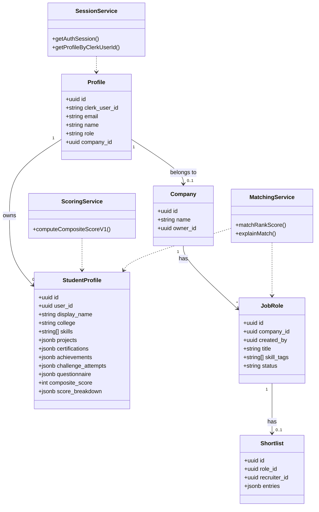

---

## 4.3.2 Object Diagram
`images/object-diagram.jpg`

**Figure 4.4: Object Diagram**

This diagram shows example runtime objects in the system.

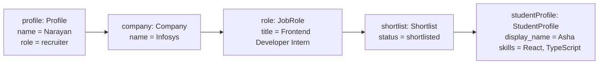

---

## 4.3.3 Collaboration Diagram
`images/collaboration-diagram.jpg`

**Figure 4.5: Collaboration Diagram**

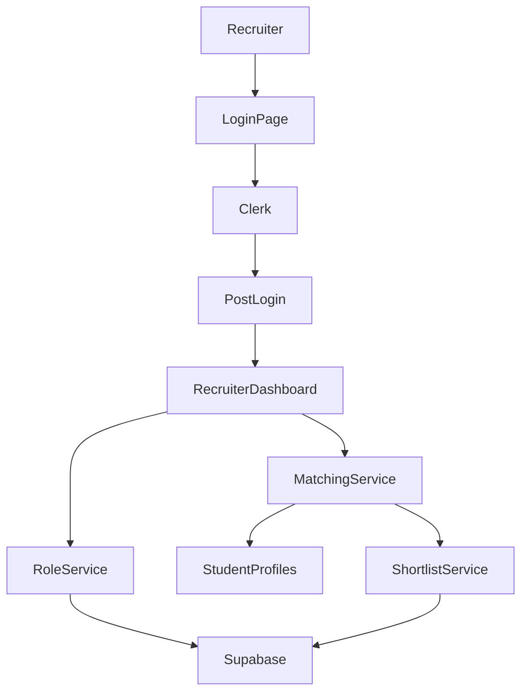

---

## 4.3.4 Use Case Diagram
`images/usecase-diagram.jpg`

**Figure 4.6: Use Case Diagram**

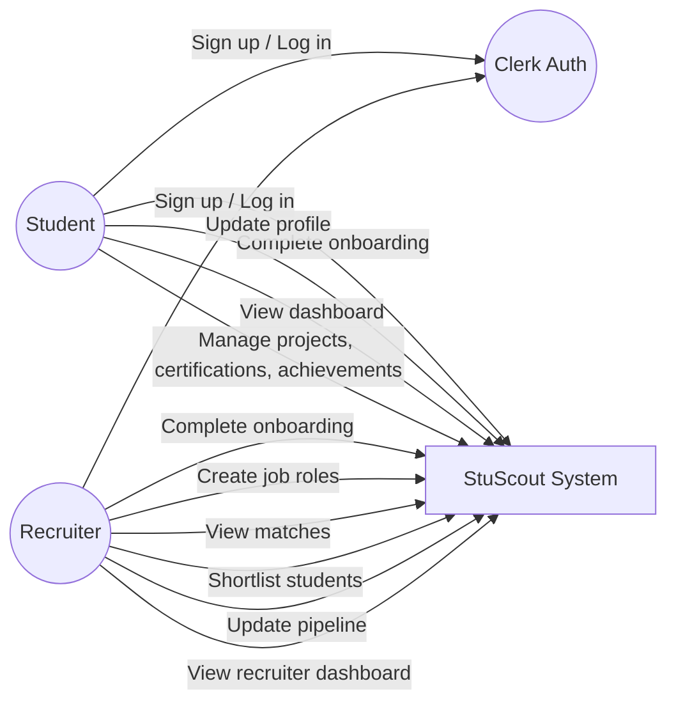

Department of Computer Science and Engineering 11

## 4.3 UML DIAGRAMS CHAPTER 4. SYSTEM DESIGN

## 4.3.5 Sequence Diagram
`images/sequence-diagram.jpg`

**Figure 4.7: Sequence Diagram**

Example: Recruiter logs in and views matched students for a role.

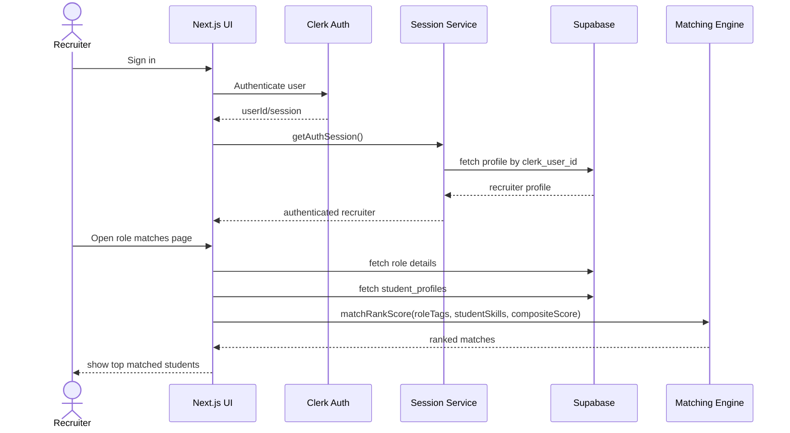

---

## 4.3.6 Activity Diagram
`images/activity-diagram.jpg`

**Figure 4.8: Activity Diagram**

Example: Student onboarding and profile completion activity flow.

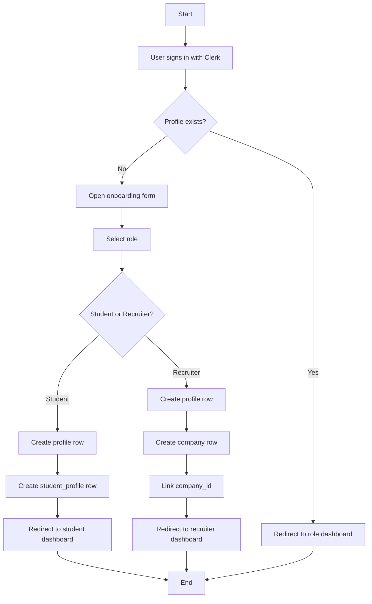

---

## 4.3.7 Component Diagram
`images/component-diagram.jpg`

**Figure 4.9: Component Diagram**

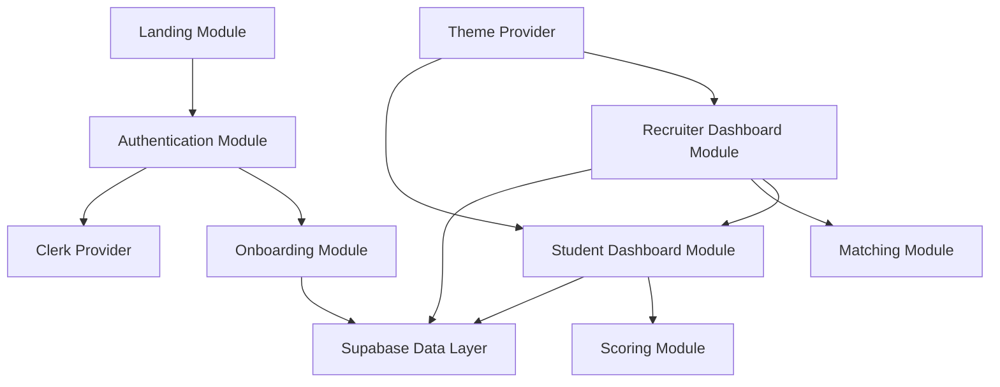

### Major Components
- `LandingHome`, `LandingNav`, section components
- Auth pages: login, register, post-login
- Onboarding form and server action
- Student shell, student overview, profile form
- Recruiter shell, recruiter overview, role pages, pipeline forms
- Scoring engine
- Matching engine
- Supabase data access utilities
- Theme provider and shared UI primitives

---

## 4.3.8 Deployment Diagram
`images/deployment-diagram.jpg`

**Figure 4.10: Deployment Diagram**

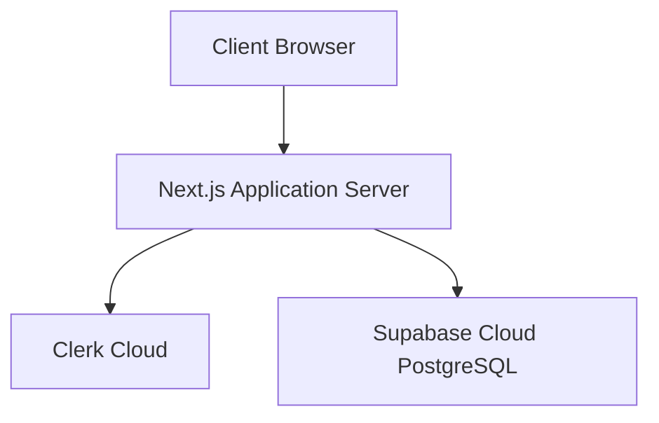

### Deployment Description
- The **client browser** accesses the Next.js web app.
- The **Next.js server** renders pages, executes server actions, and talks to Clerk and Supabase.
- **Clerk Cloud** manages authentication and sessions.
- **Supabase** stores persistent application data.

---

## 4.4 Database Design Summary

### Main Tables
1. `profiles`
   - Stores core user identity mapped to Clerk.
   - Fields: `id`, `clerk_user_id`, `email`, `name`, `role`, `company_id`

2. `companies`
   - Stores recruiter organization data.
   - Fields: `id`, `name`, `owner_id`

3. `student_profiles`
   - Stores student-specific profile data and scoring signals.
   - Fields: `display_name`, `college`, `skills`, `projects`, `certifications`, `achievements`, `challenge_attempts`, `questionnaire`, `composite_score`, `score_breakdown`

4. `job_roles`
   - Stores recruiter-posted roles.
   - Fields: `company_id`, `created_by`, `title`, `skill_tags`, `status`

5. `shortlists`
   - Stores candidate shortlist data per role.
   - Fields: `role_id`, `recruiter_id`, `entries`

---

## 4.5 Important Functional Flows

### 4.5.1 Authentication Flow
- User signs in or signs up via Clerk.
- Clerk returns authenticated session.
- App checks `profiles` table.
- If no profile exists, redirect to onboarding.
- If profile exists, redirect to student or recruiter dashboard.

### 4.5.2 Student Profile Flow
- Student updates profile fields and questionnaire.
- Server action validates form using Zod.
- Skills are normalized.
- URLs are sanitized.
- Composite score is recomputed.
- Updated profile is stored in Supabase.
- Dashboard reads the refreshed data and renders insights.

### 4.5.3 Recruiter Hiring Flow
- Recruiter creates a job role.
- System stores role with normalized skill tags.
- Matching engine compares role skill tags with student skills.
- Students are ranked using:
  - skill overlap
  - Jaccard similarity
  - student composite score
- Recruiter shortlists students and updates pipeline states:
  - shortlisted
  - scheduled
  - offered

---

## 4.6 Algorithms Used

### 4.6.1 Composite Score Calculation
The student composite score is computed using weighted signals:
- Projects
- Questionnaire
- Skills
- Assessment stub score
- Endorsements

### 4.6.2 Match Ranking Algorithm
The recruiter match ranking combines:
- Skill overlap similarity
- Student composite score

General formula:
- `match score = 0.6 * skill similarity + 0.4 * normalized composite score`

---

## 4.7 Technology Stack

- **Frontend**: Next.js 16, React 19, Tailwind CSS
- **Authentication**: Clerk
- **Database**: Supabase PostgreSQL
- **Validation**: Zod
- **UI/Animation**: Lucide React, Framer Motion, Sonner
- **Language**: TypeScript

---

## 4.8 Conclusion

The StuScout system is designed as a scalable, role-based recruitment platform focused on skill-first hiring. Its architecture separates presentation, authentication, business logic, and persistence concerns cleanly. Clerk ensures secure authentication, while Supabase provides structured relational storage. The scoring and matching modules add domain-specific intelligence for ranking students and helping recruiters make data-informed hiring decisions.
